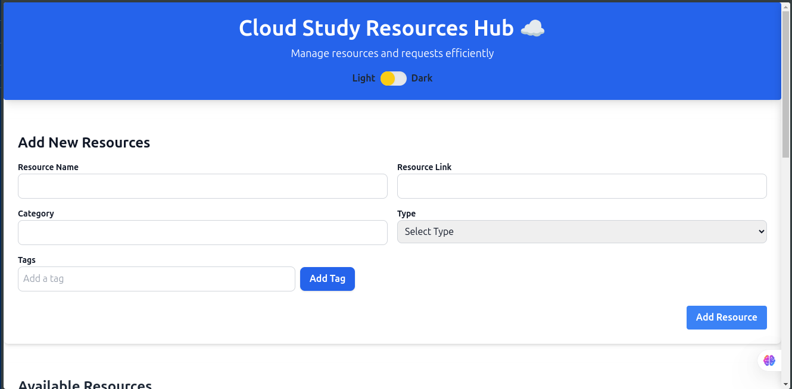

# Study Resource Hub
A web application designed to efficiently manage and share study resources. Users can add, categorize, and tag resources, ensuring easy access and organization for learning materials. The app features a user-friendly interface with light/dark mode support, making it an ideal platform for students, educators, and self-learners.

## Screenshots

*Add New Resource Form with dark/light mode toggle*

## Prerequisites
- Docker and Docker Compose
- Node.js (for local development)
- npm or yarn

## Project Setup

### 1. Environment Setup

#### Backend Environment Variables
Create a `.env` file in the `backend` directory:

```bash
# MongoDB Connection String
# For Local MongoDB:
MONGODB_URI=mongodb://localhost:27017/study_resource_hub

# For MongoDB Atlas (Cloud):
# MONGODB_URI=mongodb+srv://<username>:<password>@cluster0.xxxxx.mongodb.net/study_resource_hub?retryWrites=true&w=majority

# Server Port
PORT=5000

# JWT Secret Key (use a strong, random string for production)
# Generate a secure secret: openssl rand -base64 32
JWT_SECRET=your_jwt_secret_key_here_make_it_long_and_random
```

**Important Notes:**
- **MongoDB Local**: Use `mongodb://localhost:27017/study_resource_hub` for local development
- **MongoDB Atlas**: Replace `<username>`, `<password>`, and cluster URL with your Atlas credentials
- **JWT Secret**: Generate a secure random string for production. You can use:
  ```bash
  openssl rand -base64 32
  ```

#### Frontend Environment Variables
Create a `.env` file in the `frontend` directory:

```bash
# API Base URL
# For Local Development:
REACT_APP_API_BASE_URL=http://localhost:5000/api

# For Production/HTTPS:
# REACT_APP_API_BASE_URL=https://studyhub.local/api

# Google OAuth Client ID (optional)
REACT_APP_GOOGLE_CLIENT_ID=YOUR_GOOGLE_CLIENT_ID
```

**Note:** After updating `.env` files, restart your development server for changes to take effect.

### 2. Running with Docker Compose
The entire application stack can be run using Docker Compose:

```bash
# Build and start all services
docker-compose up --build

# Run in detached mode
docker-compose up -d

# Stop all services
docker-compose down
```

### 3. MongoDB Setup

#### Option 1: Local MongoDB with Docker
Run MongoDB using Docker:
```bash
# Pull MongoDB image
docker pull mongo

# Run MongoDB container
docker run -d -p 27017:27017 --name study-resource-mongodb mongo
```

Then use this connection string in your `backend/.env`:
```bash
MONGODB_URI=mongodb://localhost:27017/study_resource_hub
```

#### Option 2: MongoDB Atlas (Cloud)
1. Create a free account at [MongoDB Atlas](https://www.mongodb.com/cloud/atlas)
2. Create a new cluster
3. Create a database user and set a password
4. Whitelist your IP address (or use `0.0.0.0/0` for development)
5. Get your connection string from the "Connect" button
6. Update your `backend/.env` with the Atlas connection string:
```bash
MONGODB_URI=mongodb+srv://<username>:<password>@cluster0.xxxxx.mongodb.net/study_resource_hub?retryWrites=true&w=majority
```
Replace `<username>`, `<password>`, and the cluster URL with your actual credentials.

### 4. Database Migrations
To set up the initial database collections and seed data:

```bash
# Navigate to backend directory
cd backend

# Run migrations
node migrations/migrate.js
```

This will create:
- Resources collection
- Resource requests collection
- Initial seed data (if any)

### 5. Running Locally (Development)

Frontend:
```bash
cd frontend
npm install
npm start
```

Backend:
```bash
cd backend
npm install
npm run dev
```

### 6. Nginx Configuration
The project includes Nginx for reverse proxy and SSL termination. Here's how to set it up:

1. Directory Structure:
```
nginx/
├── nginx.conf         # Nginx configuration file
└── certs/            # SSL certificates directory
    ├── domain.crt    # Your domain certificate
    └── domain.key    # Your private key
```

2. Sample Nginx Configuration:
```nginx
server {
    listen 80;
    server_name your-domain.com;
    return 301 https://$server_name$request_uri;
}

server {
    listen 443 ssl;
    server_name your-domain.com;

    ssl_certificate /etc/nginx/certs/domain.crt;
    ssl_certificate_key /etc/nginx/certs/domain.key;

    # SSL configuration
    ssl_protocols TLSv1.2 TLSv1.3;
    ssl_ciphers HIGH:!aNULL:!MD5;

    # Frontend
    location / {
        proxy_pass http://frontend:3000;
        proxy_http_version 1.1;
        proxy_set_header Upgrade $http_upgrade;
        proxy_set_header Connection 'upgrade';
        proxy_set_header Host $host;
        proxy_cache_bypass $http_upgrade;
    }

    # Backend API
    location /api {
        proxy_pass http://backend:5000;
        proxy_http_version 1.1;
        proxy_set_header Upgrade $http_upgrade;
        proxy_set_header Connection 'upgrade';
        proxy_set_header Host $host;
        proxy_cache_bypass $http_upgrade;
    }
}
```

3. SSL Certificate Setup with mkcert (Local Development):

For local development with HTTPS, you can use `mkcert` to create locally-trusted certificates:

**Install mkcert:**
```bash
# On macOS
brew install mkcert

# On Linux
# Ubuntu/Debian
sudo apt install libnss3-tools
wget -O mkcert https://github.com/FiloSottile/mkcert/releases/latest/download/mkcert-v1.4.4-linux-amd64
chmod +x mkcert
sudo mv mkcert /usr/local/bin/

# On Windows (using Chocolatey)
choco install mkcert
```

**Create Local CA and Certificates:**
```bash
# Install the local CA (one-time setup)
mkcert -install

# Navigate to nginx certs directory
cd nginx/certs

# Generate certificate for your local domain (e.g., studyhub.local)
mkcert studyhub.local

# This creates:
# - studyhub.local.pem (certificate)
# - studyhub.local-key.pem (private key)
```

**Update nginx.conf:**
Ensure your `nginx.conf` references the correct certificate files:
```nginx
ssl_certificate /etc/nginx/certs/studyhub.local.pem;
ssl_certificate_key /etc/nginx/certs/studyhub.local-key.pem;
```

**Update /etc/hosts (for local domain):**
Add your local domain to `/etc/hosts`:
```bash
# Linux/macOS
sudo nano /etc/hosts

# Add this line:
127.0.0.1    studyhub.local
```

**For Production SSL Certificates:**
- Use Let's Encrypt with certbot for free SSL certificates
- Or use certificates from your certificate authority
- Place certificates in the `nginx/certs` directory
- Update the `nginx.conf` with your domain name
- Ensure proper permissions on certificate files (chmod 600 for keys)

4. Custom Domain Setup:
- Point your domain's DNS A record to your server's IP address
- Update the `server_name` directive in nginx.conf with your domain
- Reload Nginx configuration:
```bash
docker-compose exec nginx nginx -s reload
```

## Project Structure
```
study-resource-hub/
├── frontend/          # React TypeScript frontend
├── backend/           # Node.js backend
├── nginx/            # Nginx configuration
│   ├── nginx.conf    # Nginx config file
│   └── certs/        # SSL certificates
├── docker-compose.yml # Docker compose configuration
└── .gitignore        # Git ignore file
```

## API Documentation
The backend API is available at `http://localhost:5000` with the following endpoints:
- `/api/resources` - Resource management
- `/api/auth` - Authentication endpoints
- `/api/requests` - Resource request management

## Contributing
1. Fork the repository
2. Create your feature branch (`git checkout -b feature/AmazingFeature`)
3. Commit your changes (`git commit -m 'Add some AmazingFeature'`)
4. Push to the branch (`git push origin feature/AmazingFeature`)
5. Open a Pull Request

## License
This project is licensed under the MIT License - see the LICENSE file for details

